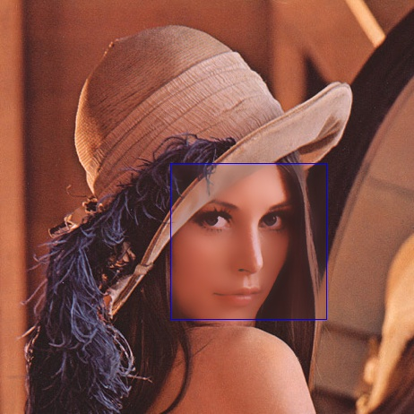

# 图像滤镜效果实现
 
吴家行 2020213991

本作业实现了以下两种滤镜：
- 人像美肤
- 晶格化效果

本作业采用c++进行滤镜效果的实现，使用CMake进行构建工程，使用Lenna图进行效果评价。

两个作业的代码保存在`code`目录下，人像美肤代码保存在`code/face_beauty_filter`目录下，晶格化效果代码保存在`code/crystallization_filter`目录下，两个滤镜的代码相互独立。

本作业依赖的工具库：
- [opencv-4.4.0](https://opencv.org/releases/)

## 1 人像美肤

### 1.1 算法介绍

人像美肤主要由人脸检测+双边滤波进行实现。

人脸检测由于不是滤镜任务，因此本作业直接调用opencv封装好的级联分类器`CascadeClassifier`中的`detectMultiScale`函数进行人脸检测，特征文件保存在`code/face_beauty_filter/data/haarcascade_frontalface_default.xml`文件中。

人脸检测效果如下：
</img>

识别到人脸的位置和大小后，对这个区域进行双边滤波。双边滤波（Bilateral filter）是一种非线性的滤波方法，是结合图像的空间邻近度和像素值相似度的一种折衷处理，同时考虑空域信息和灰度相似性，达到保边去噪的目的。具有简单、非迭代、局部的特点。

主要用到两个权重函数：
- 空间权重
$$
weight\_space=e^{-\frac{(i-k)^2+(j-l)^2}{2\sigma_s^2}}
$$
- 颜色权重
$$
weight\_color=e^{-\frac{\|f(i,j)-f(k,l)\|^2}{2\sigma_r^2}}
$$

因此总权重为：$w=weight\_space*weight\_color$

最后得到双边滤波的总公式：
$$
g(i,j) = \frac{\sum{f(k,l)w(i,j,k,l)}}{\sum{w(i,j,k,l)}}
$$
$g(i,j)$是输出点的像素值，$f(i,j)$是模版中输入点的像素值，w(i,j,k,l)代表各像素点的权重。

本作业设置的滤波器模版大小$d=15$，$\sigma_r=30$，$\sigma_s=15$。

### 1.2 运行步骤
1. 下载opencv源代码: https://github.com/opencv/opencv/archive/4.4.0.zip, 将代码解压放置在`code/face_beauty_filter/3rdparty/`目录中，即`code/face_beauty_filter/3rdparty/opencv-4.4.0`。
2. 编译安装opencv
```shell
cd code/face_beauty_filter/3rdparty/opencv-4.4.0
mkdir build
cd /build
cmake -D CMAKE_BUILD_TYPE=RELEASE -D CMAKE_INSTALL_PREFIX=../../../lib/opencv ..
make -j8 
make install
```
3. 编译主程序
```shell
cd code/face_beauty_filter
mkdir build
cd build
cmake ..
make
```
4. 运行，输出图片保存在`code/face_beauty_filter/imgs/out_lenna_my.jpg`中
```shell
cd code/face_beauty_filter/build
./Demo
```

原图：
</img>

人像美肤后：
</img>

## 2 晶格化效果
### 2.1 算法介绍

晶格化滤镜主要是基于超像素分割SLIC（simple linear iterative clustering）+块内平均来实现。

超像素分割其实是一种k-means聚类的方法，首先在像素点为$N$个的图像上均匀选取$k$个点作为聚类中心，聚类中心之间的距离为$S= \sqrt{N/k}$,然后在每个聚类中心周围采样，采样区域是一个正方形区域，边长为$2S。

聚类的目标是使各个像素到所属的超像素中心的距离之和最小，这个距离同时考虑了空间距离和颜色距离，空间距离就是坐标纬度上的距离，而颜色距离是Lab颜色空间的距离，距离$D$表示如下：

$$
d_c=\sqrt{(l_i-l_j)^2+(a_i-a_j)^2+(b_i-b_j)^2} \\
d_s=\sqrt{(x_i-x_j)^2+(y_i-y_j)^2} \\
D=\sqrt{d_c^2+(d_s/S)^2m^2}
$$
迭代过程如下：
1. 将RGB颜色空间转化为Lab颜色空间，初始化所有聚类的中心
2. 计算每个像素点到各个聚类中心的距离，将其和距离最小的聚类中心归为一类
3. 重新计算新的聚类中心点，计算残差，若残差小于阈值，则到步骤2； 若残差小于阈值，则到步骤4。
4. 每个聚类中的所有像素点和聚类中心的Lab颜色一致，最后将Lab颜色空间转化为RGB颜色空间。

本作业设置的聚类中心点$K=64*64$，距离公式中参数$m=40$，迭代10次。

### 2.2 运行步骤
1. 下载opencv源代码: https://github.com/opencv/opencv/archive/4.4.0.zip, 将代码解压放置在`code/crystallization_filter/3rdparty/`目录中，即`code/crystallization_filter/3rdparty/opencv-4.4.0`。
2. 编译安装opencv
```shell
cd code/crystallization_filter/3rdparty/opencv-4.4.0
mkdir build
cd /build
cmake -D CMAKE_BUILD_TYPE=RELEASE -D CMAKE_INSTALL_PREFIX=../../../lib/opencv ..
make -j8 
make install
```
3. 编译主程序
```shell
cd code/crystallization_filter
mkdir build
cd build
cmake ..
make
```
4. 运行，输出图片保存在`code/crystallization_filter/imgs/out_lenna_my.jpg`中
```shell
cd code/crystallization_filter/build
./Demo
```
原图：
</img>

晶格化后效果：
</img>
